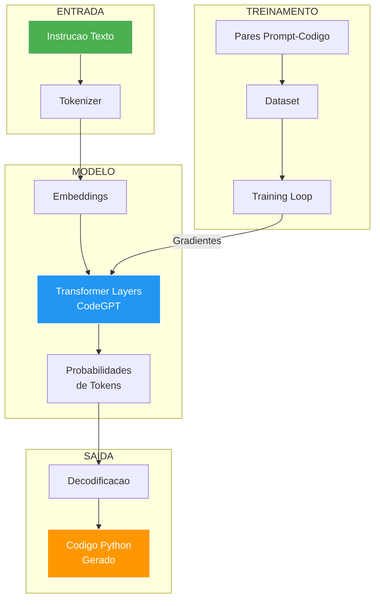
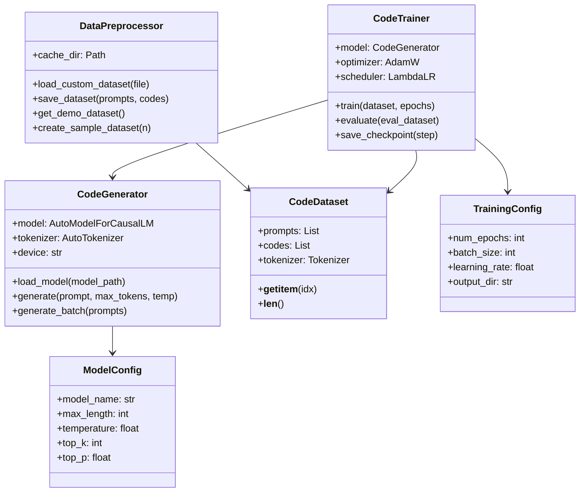

<div align="center">

# 🌱 PROJECT GENESIS

### Gerador de Codigo com Inteligencia Artificial


<br/>

O **Project Genesis** e uma plataforma que gera **codigo Python funcional** a partir de instrucoes em linguagem natural. Descreva *o que* quer em portugues, e o sistema gera o codigo correspondente.

</div>

---

## 📋 Sumario

- [Como Funciona](#como-funciona)
- [Arquitetura](#arquitetura)
- [Demonstracao](#demonstracao)
- [Estrutura do Projeto](#estrutura-do-projeto)
- [Instalacao](#instalacao)
- [Uso](#uso)
- [Treinamento](#treinamento)
- [Tecnologias](#tecnologias)
- [Roadmap](#roadmap)
- [Contribuindo](#contribuindo)
- [Licenca](#licenca)

---

## Como Funciona

```
┌─────────────────┐     ┌──────────────┐     ┌─────────────┐     ┌──────────────┐
│  Instrucao em   │────>│ Tokenizacao  │────>│   Modelo    │────>│   Codigo     │
│  Linguagem      │     │ (HuggingFace)│     │  (CodeGPT)  │     │  Gerado      │
│  Natural        │     │              │     │             │     │  (Python)    │
└─────────────────┘     └──────────────┘     └─────────────┘     └──────────────┘
    "Escreva uma            Entra no              IA analisa          Codigo
     funcao que            transformer            o contexto         funcional
     calcule fatorial"                                                 pronto
```

1. Voce digita uma instrucao em portugues
2. O texto e transformado em tokens (numeritos que a IA entende)
3. O modelo de linguagem processa os tokens e gera codigo
4. O codigo gerado e retornado formatado e pronto para uso

---

## Arquitetura





---

## Demonstracao

```
$ python src/inference.py "Escreva uma funcao que verifique se um numero e primo"

Gerando codigo...

--- Codigo Gerado ---
def eh_primo(n):
    if n < 2:
        return False
    for i in range(2, int(n**0.5) + 1):
        if n % i == 0:
            return False
    return True
--- Fim ---
```

**Modo interativo:**
```
$ python src/inference.py --interactive

============================================================
  PROJECT GENESIS - Gerador de Codigo com IA
  Modo Interativo
  Digite 'sair' ou 'quit' para encerrar
============================================================

Instrucao > Crie uma funcao que conte as vogais de uma string

Gerando codigo...

--- Codigo Gerado ---
def contar_vogais(s):
    vogais = 'aeiou'
    return sum(1 for c in s.lower() if c in vogais)
--- Fim ---

Instrucao > sair
Ate logo!
```

---

## Estrutura do Projeto

```
project-genesis/
│
├── README.md               # Este arquivo
├── LICENSE                  # Licenca MIT
├── requirements.txt         # Dependencias do projeto
├── .gitignore              # Arquivos ignorados pelo Git
│
├── src/                    # Codigo-fonte principal
│   ├── __init__.py
│   ├── inference.py        # Gerador de codigo (CLI + classe principal)
│   │
│   ├── model/              # Configuracoes do modelo
│   │   ├── __init__.py
│   │   └── config.py       # ModelConfig e TrainingConfig
│   │
│   ├── data/               # Processamento de dados
│   │   ├── __init__.py
│   │   └── preprocessor.py # Dataset, preprocessor, dados de exemplo
│   │
│   └── training/           # Treinamento do modelo
│       ├── __init__.py
│       └── trainer.py      # Loop de treinamento e evaluacao
│
├── notebooks/              # Experimentacao
│   └── exploration.ipynb   # Notebook exploratorio
│
├── outputs/                # Artefatos gerados (gitignore)
│   ├── models/             # Checkpoints do modelo
│   └── logs/               # Logs de treinamento
│
└── docs/                   # Documentacao
    └── project_vision.md   # Visao e roadmap do projeto
```

---

## Instalacao

### 1. Clone o repositorio

```bash
git clone https://github.com/Tinho2508/project-genesis.git
cd project-genesis
```

### 2. Crie e ative o ambiente virtual

```bash
python -m venv venv

# Windows
venv\Scripts\activate

# Linux/macOS
source venv/bin/activate
```

### 3. Instale as dependencias

```bash
pip install -r requirements.txt
```

---

## Uso

### Gerar codigo com um prompt

```bash
python src/inference.py "Escreva uma funcao que calcule o fatorial de um numero"
```

### Modo interativo

```bash
python src/inference.py --interactive
```

### Usar modelo treinado

```bash
python src/inference.py --model outputs/models/final "Crie um palindromo"
```

### Parametros opcionais

| Parametro | Descricao | Default |
|:---|:---|:---:|
| `--model` / `-m` | Caminho do modelo treinado | modelo base |
| `--interactive` / `-i` | Modo interativo | false |
| `--max-tokens` | Maximo de tokens a gerar | 256 |
| `--temperature` / `-t` | Temperatura de sampling | 0.7 |

---

## Treinamento

### Usando o dataset de demonstracao

```python
from src.model.config import ModelConfig, TrainingConfig
from src.data.preprocessor import DataPreprocessor, CodeDataset
from src.training.trainer import CodeTrainer
from transformers import AutoModelForCausalLM, AutoTokenizer

# Configurar
model_config = ModelConfig()
training_config = TrainingConfig()

# Carregar modelo
tokenizer = AutoTokenizer.from_pretrained(model_config.model_name)
model = AutoModelForCausalLM.from_pretrained(model_config.model_name)

# Preparar dados
preprocessor = DataPreprocessor()
prompts, codes = preprocessor.get_demo_dataset()
dataset = CodeDataset(prompts, codes, tokenizer)

# Treinar
trainer = CodeTrainer(model, tokenizer, training_config)
history = trainer.train(dataset)
```

### Usando dados customizados

Crie um arquivo JSON com o formato:
```json
[
    {"prompt": "Escreva uma funcao que...", "code": "def minha_funcao():..."},
    {"prompt": "Crie um script que...", "code": "import os\n..."}
]
```

```python
preprocessor = DataPreprocessor()
prompts, codes = preprocessor.load_custom_dataset("meu_dataset.json")
dataset = CodeDataset(prompts, codes, tokenizer)
```

---

## Tecnologias

| Tecnologia | Versao | Funcao |
|:---|:---:|:---|
| **Python** | 3.10+ | Linguagem principal |
| **PyTorch** | 2.1+ | Framework de deep learning |
| **HuggingFace Transformers** | 4.36+ | Modelos de linguagem |
| **HuggingFace Datasets** | 2.16+ | Gerenciamento de dados |
| **CodeGPT** | - | Modelo base para geracao de codigo |
| **Jupyter** | 1.0+ | Experimentacao |

---

## Roadmap

- [x] **Fase 1:** Prototipacao com modelo pre-treinado (CodeGPT)
- [x] **Fase 2:** Pipeline de treinamento com dados customizados
- [ ] **Fase 3:** Fine-tuning com datasets de codigo maiores
- [ ] **Fase 4:** Interface grafica para interacao
- [ ] **Fase 5:** Avaliacao automatizada (BLEU, pass@k)
- [ ] **Fase 6:** Deploy como API REST

---

## Contribuindo

Contribuicoes sao muito bem-vindas!

1. Faca um fork do repositorio
2. Crie uma branch para sua feature (`git checkout -b feature/minha-feature`)
3. Faca commit das suas mudancas (`git commit -m 'Adiciona minha feature'`)
4. Faca push para a branch (`git push origin feature/minha-feature`)
5. Abra um Pull Request

---

## Licenca

Este projeto esta sob a licenca MIT. Veja o arquivo [LICENSE](LICENSE) para detalhes.
